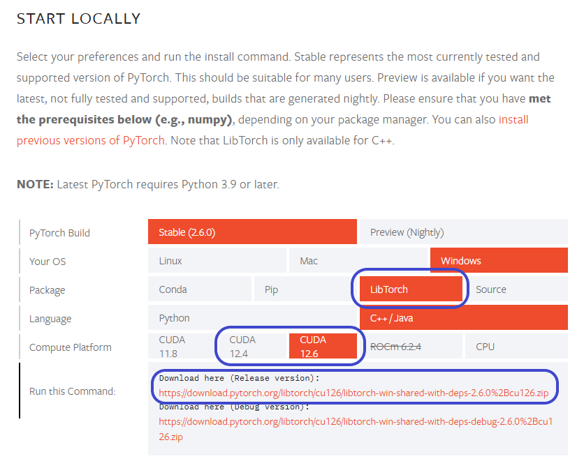

<h1 align="center">PPO-LibTorch 🚀</h1>
<p align="center">
<b>A high-performance C++ implementation of <a href="https://openai.com/index/openai-baselines-ppo/"><b>Proximal Policy Optimization (PPO)</b></a></b>
</p>

<p align="center">
    <a href="https://github.com/AidanShipperley/PPO-LibTorch/actions/workflows/ubuntu-build-260-126.yml" rel="nofollow"></a>
    <a href="https://github.com/AidanShipperley/PPO-LibTorch/actions/workflows/windows-build-260-126.yml" rel="nofollow"></a>
</p>

**PPO-LibTorch** is a robust, high-performance, fully open-source implementation of [**Proximal Policy Optimization (PPO)**](https://openai.com/index/openai-baselines-ppo/) built purely in C++ using [**LibTorch**](https://pytorch.org/cppdocs/frontend.html), the official C++ frontend for [**PyTorch**](https://pytorch.org/). PPO-LibTorch is a clean, efficient, and fully customizable PPO implementation optimized for performance-critical environments requiring low latency, high performance, or multithreaded environments where existing Python implementations may not be practical.

Inspired by the insightful [ICLR PPO Implementation Blog by Huang, et al.](https://iclr-blog-track.github.io/2022/03/25/ppo-implementation-details/), PPO-LibTorch prioritizes clarity, performance, and usability.

## ✨ Key Features

### 🔥 Optimized for Performance
- **Truly Parallel Environments:**
    - Efficient vectorized environments are run and managed in parallel via a custom thread-pool
    - Single-process architecture, removing the overhead of inter-process communication
    - Ideal for applications requiring real-time inference and low latency
- **CUDA Optimization Suite:**
    - Leverages low-level C++, CUDA, and PyTorch access to maximize training speed
    - TF32 Tensor Cores utilization on compatible GPUs for significant speedups (~7x speedup)
    - cuDNN benchmark mode enabled for stable and efficient training (~5x speedup)
    - Optionally, users can use mixed-precision for a potentially massive speedup at the cost of precision

### 🌐 Easy Adaptation to Your Environment
- **Highly Readable and Documented Code:**
    - Clean, readable C++ implementation closely mirrors standard Python PPO implementations
    - Extensive in-line documentation and clear naming conventions

- **Fully Customizable Training via `.toml` Config:**
    - All hyperparameters are customizable without recompiling
    - Clear, documented, and user-friendly hyperparameter documentation on the wiki

- **Example Environments Included:**
    - Out-of-the-box CartPole environment implementation for immediate testing
    - Easy-to-use API to create your own environments without altering the core PPO logic

### 🛡️ Production-Ready Features
- **Robust Error Handling:** Comprehensive exception handling for stable operation
- **Automatic Checkpointing:** Save and resume training with automatic checkpoint management
- **Multi-Platform Support:** Works on both Windows and Linux with continuous integration
- **Custom Environment Framework:** Easily implement your own training environments
- **Direct Integration:** Embed directly into game engines, robotics systems, or other C++ applications

## 📖 Table of Contents
1. [Requirements](#-requirements)
2. [Build from Source](#️-building-from-source)
    1. [Windows](#windows)
    2. [Linux](#linux)
    3. [Testing Your Build](#testing-your-build)
4. [Running Example Environment (CartPole)](#️-running-example-environment-cartpole)
5. [Documentation & Wiki](#-documentation--wiki)
6. [Contributing](#-contributing)
7. [Acknowledgments](#acknowledgments)

## 📋 Requirements

1. **OS:** A Windows or Linux machine
2. **Build System:** [CMake](https://cmake.org/download/) (≥ 3.19)
3. **LibTorch:** [LibTorch](https://pytorch.org/get-started/locally/) (≥ 2.6.0)
&emsp;&emsp;&emsp;
4. **CUDA Toolkit:** Optional but highly recommended for GPU acceleration ([CUDA ≥12.4](https://developer.nvidia.com/cuda-toolkit-archive))
5. **cuDNN:** Optional for optimized GPU training ([cuDNN ≥9.7.0](https://developer.nvidia.com/cudnn-archive))

> Note: You may select either CPU or CUDA, but CUDA is highly recommended for optimal performance. You must have an NVIDIA GPU to use CUDA.

## 🛠️ Building from Source

## Build

Below are the steps necessary to build this project on your machine.

### Windows

To build this project on Windows, it is recommended that you have Visual Studio 2019 or later and install C++ build tools through the visual studio installer. This is Microsoft's recommended method of accessing C++ build tools on Windows. This section will detail how to build assuming you have Visual Studio.

1. In order to easily access the Clang executable to compile, type `x64` into the Windows search bar and open up the program labeled `x64 Native Tools Command Prompt for VS 20XX`.

2. Confirm that you can run the following commands without any errors and see version numbers:
    ```bash
    cl.exe
    ```

    ```bash
    ninja --version
    ```

    ```bash
    nvcc --version
    ```

3. Nativagate to a directory and clone the repository:
    ```bash
    F:
    cd "F:\Code\"
    ```

    ```bash
    git clone --recurse-submodules https://github.com/AidanShipperley/PPO_LibTorch.git
    ```

    ```bash
    cd "F:\Code\PPO-LibTorch\"
    ```

4. Configure the x64 Release build by running the following.

    > Usage: `.\build-windows.bat CUDA_PATH CMAKE_PREFIX_PATH [delete]`
    1. Set `CUDA_PATH` to the root directory of your CUDA Toolkit. On Windows, this should be located at `C:\Program Files\NVIDIA GPU Computing Toolkit\CUDA\vXX.x\`
    2. Set `CMAKE_PREFIX_PATH` to the root directory of your Libtorch installation. This should be the parent directory containing your `\bin` and `\lib` folders.
    3. Optionally, pass `delete` to clean up the existing build directory. Ensure you save your model checkpoints or config files as this deletes everything in the build directory.

    ```bash
    .\build-windows.bat "C:\Program Files\NVIDIA GPU Computing Toolkit\CUDA\v12.6" "D:\a\PPO-LibTorch\PPO-LibTorch\libtorch\libtorch" delete
    ```

### Linux

To build this project on Linux, you can follow these steps.

1. Ensure you have libtbb and the Ninja generator:
    ```bash
    sudo apt update
    sudo apt install libtbb-dev ninja-build
    ```

2. Ensure you have the necessary build tools:
    ```bash
    g++ --version
    ```

    ```bash
    ninja --version
    ```

    ```bash
    nvcc --version
    ```

3. Navigate to a directory and clone the repository:
    ```bash
    git clone --recurse-submodules https://github.com/AidanShipperley/PPO_LibTorch.git
    ```

4. Configure the Linux Release build by running the following.

    > Usage: `./build-linux.sh CUDA_PATH CMAKE_PREFIX_PATH [delete]`
    1. Set `CUDA_PATH` to the root directory of your CUDA Toolkit. On Ubuntu, this should be located at `/usr/local/cuda-XX.x/`
    2. Set `CMAKE_PREFIX_PATH` to the root directory of your Libtorch installation. This should be the parent directory containing your `/bin` and `/lib64` folders.

    ```bash
    ./build-linux.sh "/usr/local/cuda-12.6" "/home/runner/work/PPO-LibTorch/PPO-LibTorch/libtorch/libtorch" delete
    ```

### Testing Your Build
After building, confirm CUDA/cuDNN support and benchmark your system:

```bash
# Windows
.\CompilationChecker.exe

# Linux
./CompilationChecker
```

## ▶️ Running Example Environment (CartPole)

Out of the box, running the built application will run the example environment which is a C++ recreation of [Cart Pole](https://www.gymlibrary.dev/environments/classic_control/cart_pole/). 
```bash
# Windows
.\PPO.exe

# Linux
./PPO
```

Ensure that you have 

## 📖 Documentation & Wiki

Comprehensive documentation and explanations for each hyperparameter and function can be found in our wiki.

## 🤝 Contributing

Contributions, bug reports, and feature requests are highly welcome! Please open an issue or submit a pull request.

## Acknowledgments

- The [ICLR Blog Post by Huang, et al](https://iclr-blog-track.github.io/2022/03/25/ppo-implementation-details/) for the excellent PPO implementation details
- [TOML++](https://github.com/marzer/tomlplusplus) for allowing easy `.toml` file support
- The PyTorch team for LibTorch, the C++ frontend for PyTorch

---

⭐ **Star the repository** if you find it helpful or want to see its development continue!

*Advanced argument parsing and experiment logging coming soon!*
